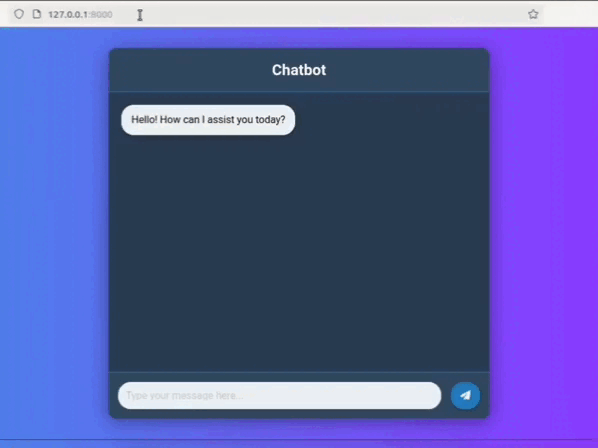

# Chatbot

This project implements a chatbot using Retrieval and vector database  and generation model with FastAPI for the backend, SQLAlchemy for database interactions, and Jinja2 for rendering a simple web interface. The chatbot generate answer for your 's question based on most relevant retrival documents, providing users with accurate and contextually relevant answers.





## Table of Contents

- [Features](#features)
- [Technologies Used](#technologies-used)
- [Dataset](#dataset)
- [Installation](#installation)
- [Usage](#usage)
- [API Endpoints](#api-endpoints)
- [Folder Structure](#folder-structure)


## Features

- Document retrieval using Retrival model.
- Simple web interface using Jinja2 templates.
- Fast and efficient API built with FastAPI.
- Database management with SQLAlchemy.
- Supports various query formats for searching.
- Generate model to get answer base user 's query .

## Technologies Used

- [FastAPI](https://fastapi.tiangolo.com/) - A modern, fast (high-performance) web framework for building APIs with Python 3.6+.
- [SQLAlchemy](https://www.sqlalchemy.org/) - SQL toolkit and Object-Relational Mapping (ORM) library for Python.
- [Jinja2](https://jinja.palletsprojects.com/en/3.0.x/) - A templating engine for Python to render HTML templates.
- [LangChain](https://langchain.readthedocs.io/en/latest/) - Framework for building applications with LLMs.
- [Pydantic](https://pydantic-docs.helpmanual.io/) - Data validation and settings management using Python type annotations.

## Dataset
Falah/arxiv-research-paper
- run dataset.py file to create pdf of research paper .

## Installation

To get started with this project, follow these steps:

1. Clone the repository:

```bash
   
git clone https://github.com/Shymaa2611/RAG_chatbot.git
cd RAG_chatbot
   
```

2. Install the required packages:
```bash
pip install -r requirements.txt

```

## Usage

Start the FastAPI server:
```bash
uvicorn app:app --reload
```
2. Open your web browser and go to http://localhost:8000 to access the interface.

3. Enter your query in the prompt bar and hit "Search" to retrieve results.

## API Endpoints
```bash
GET /: Renders the main chatbot interface.
GET /get_answer: Accepts a query and returns answer .
```
``` bash
RAG_chatbot/
│
├── app/                      # Main application directory
│   ├── __init__.py
│   ├── main.py               # FastAPI application
│   ├── models.py             # SQLAlchemy models
│   ├── templates/            # Jinja2 templates
│   ├── crud.py/              
│   └── database.py/             
│   └── model/ 
├── requirements.txt          # Required packages
└── README.md                 # Project documentation
└── model.ipynb               
```